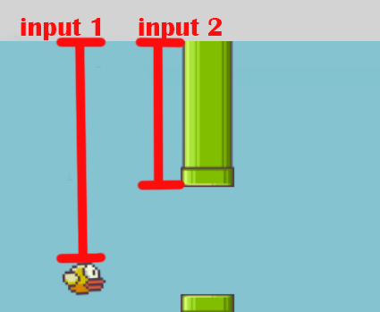

# flappy-bird-neural-net

An Artificial Inteligence that learns how to play Flappy Bird.

## Overview

Game is based on a Evolutionary Neural Network, that is, an Artificial Neural Network combined with an Genetic Algorithm.

The neural network is created to determine wether a bird should flap (go up) or not. It is firstly randomly initiated and then adjusted as birds population evolves.

## Neural Network

Each bird has its own brain (i.e neural network) consisted of 3 simple layers.

1. an input layer with 2 neuron representing what a bird sees;
    * its relative Y position on the map 
    * top pipe's relative position on the map

2. a hidden layer with 3 neurons;

3. an output layer with 2 layers to provide the two possible action of the bird

 

## Genetic Algorithm

Two main things are defined so the algorithm can work.

* Fitness
    * FrameCounts - 10 * (bird distance to pipe gap) 
* Population evolution
    1. Initiate 50 random birds
    2. Select best 2 birds (parents) based on its fitness.
    3. Copy parents to next generation.
    4. Mutate parents to complete the population size.
    5. Go back to step 2.

## Game

An online version of the game can be found
[here](https://miiguelkf-flappy-bird.netlify.app/
)

## References

https://www.youtube.com/watch?v=Rs_rAxEsAvI&t=7952s&ab_channel=freeCodeCamp.org
https://www.youtube.com/watch?v=c6y21FkaUqw&ab_channel=TheCodingTrain